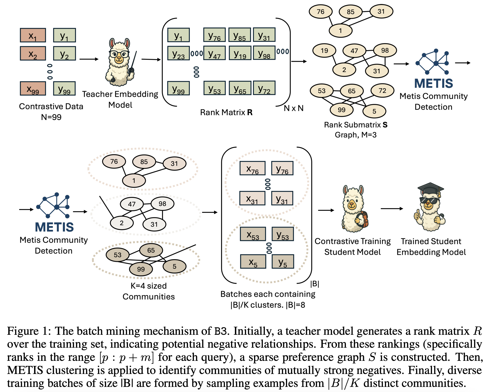
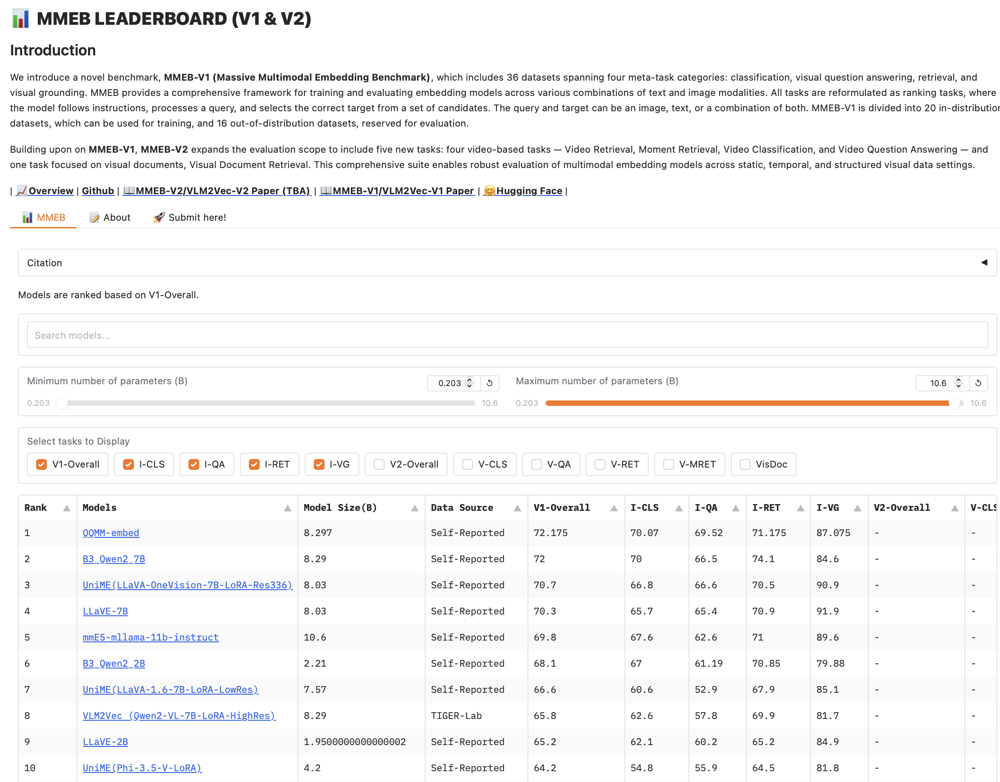

# B3

Preprint Out: https://arxiv.org/pdf/2505.11293

This repo contains the code and data for **Breaking the Batch Barrier (B3) of Contrastive Learning via Smart Batch Mining** (B3). The model attains state-of-the-art results on Massive Multimodal Embeddings Benchmark (MMEB). Specifically, for retrieval, our model significantly outperforms other methods. Our 2B model surpasses the performance of several existing 7B models. The following figure details our methodology.
<div align="center">

</div>

---

  
Our model ranks top on the [MMEB Leaderboard](https://huggingface.co/spaces/TIGER-Lab/MMEB-Leaderboard) on May 15th, 2025.



## 🧠 Trained Models

| Model Scale | Hugging Face Model Hub |
|-------------|-------------------------|
| 2B          | [raghavlite/B3_Qwen2_2B](https://huggingface.co/raghavlite/B3_Qwen2_2B) |
| 8B          | [raghavlite/B3_Qwen2_7B](https://huggingface.co/raghavlite/B3_Qwen2_7B) |


## Batch mining and Training data creation
Look at the [data_processing/](data_processing/) folder. This tstep is already done and the data provided in MMEB-train2


## Training

The training command below is configured for **8 GPUs**, but it can be easily modified to run on **4 GPUs**.  
This exact training command was used to train **B3++ Qwen2b**.

```bash
torchrun --nproc_per_node=8 --master_port=2215 --max_restarts=0 train.py \
    --output_dir ./MMEB-trainedmodels/0425_InstuctionP_odibn32_sdibn_20D_HNPS_Metis_bs1024.32bi_30.130_30P.10.5_70.170_qwen2b_2k_dy \
    --lora --lora_r 8 \
    --model_name Qwen/Qwen2-VL-2B-Instruct \
    --bf16 --pooling eos --normalize True --temperature 0.02 \
    --dataloader_num_workers 0 \
    --dataset_config configs/data_configs/mmeb_new/mmeb20_HNPS_bs32bi_30.130_30P.10.5_70.170_qwen2b.yaml \
    --grad_cache True --per_device_train_batch_size 128 \
    --gc_q_chunk_size 128 --gc_p_chunk_size 128 --gc_dynamic_limit 64 \
    --lr_scheduler_type linear --learning_rate 1e-4 --max_steps 2000 --warmup_steps 200 \
    --save_steps 1000 --logging_steps 1 --save_safetensors False --remove_unused_columns False \
    --resume_from auto --resize_use_processor True --interleave_batch_size 1 --ddp_timeout 14400 \
    --ignore_data_skip true --eval_steps 200 --eval_strategy steps \
    --eval_dataset_name TIGER-Lab/MMEB-eval --eval_subset_name MSCOCO_i2t \
    --eval_image_dir ../VLM2Vec/MMEB-eval/eval_images --per_device_eval_batch_size 2 \
    --sdibn --odibn --chunk_size 32
```

---

#### Key Parameters

| Argument | Description |
|-----------|--------------|
| `--chunk_size 32` | Picks 32-sized clusters from the dataset file. Used later in `odibn`. |
| `--grad_cache`, `--gc_*` | Enables dynamic gradient cache chunking. Values generally don’t need changing unless running on low-memory GPUs. |
| `--sdibn` | Enables batches to be mined from the same dataset (e.g., all examples in a batch are mined from `MSCOCO_i2t`). |
| `--odibn` | Applies B3 clustering. Picks `chunk_size`-sized clusters and puts random `(batch_size / chunk_size)` clusters in the same batch. |
| `--pos_only` | Removes hard negatives and only relies on in-batch negatives. By default, `--odibn` uses hard negatives from `MMEB-train2` datasets. |
| `--dataset_config $path` | Path to training dataset configuration file. |

## Inference & Evaluation

Download the image file zip from huggingface
```bash
wget https://huggingface.co/datasets/TIGER-Lab/MMEB-eval/resolve/main/images.zip
unzip images.zip -d eval_images/
```

1. To evaluate our model on an MMEB dataset (e.g., MSCOCO_i2t), run:
```bash 
python  eval_mmeb.py  --model_name raghavlite/B3_Qwen2_7B --encode_output_path  ./MMEB-evaloutputs/B2_Qwen2_7B/  --pooling  eos  --normalize  True  --lora  --lora_r  8  --bf16  --dataset_name  TIGER-Lab/MMEB-eval  --subset_name  MSCOCO_i2t  --dataset_split  test  --per_device_eval_batch_size  4  --image_dir  eval_images/  --tgt_prefix_mod
```


## Running on your Data

To run B3 models on your dataset, just repurpose the **eval_mmeb.py** code. It is quick and simple to do. Lines 120-126 create a query dataset. Lines 127-138 create a target dataset. Ensure your data is in the same format as a reference query and target dataset (Eg. MSCOCO_i2t or MSCOCO_t2i). Lines 159-160 extract query embeddings and Lines 172-172 extract target embeddings. We will soon release a much simpler script for general purpose usage.

## Acknowledgement
- We have adapted code from [VLM2Vec]([https://github.com/TIGER-AI-Lab/VLM2Vec]).