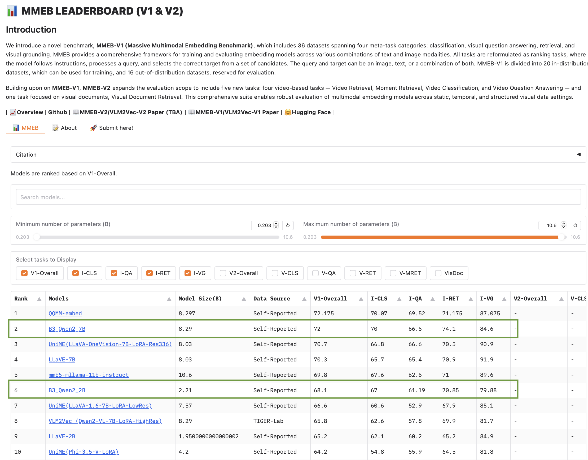

# B3

Preprint Out: https://arxiv.org/pdf/2505.11293

This repo contains the code and data for **Breaking the Batch Barrier (B3) of Contrastive Learning via Smart Batch Mining** (B3). The model attains state-of-the-art results on Massive Multimodal Embeddings Benchmark (MMEB). Specifically, for retrieval, our model significantly outperforms other methods. Our 2B model surpasses the performance of several existing 7B models. The following figure details our methodology.
<div align="center">

</div>

---

  
Our model ranks top on the [MMEB Leaderboard](https://huggingface.co/spaces/TIGER-Lab/MMEB-Leaderboard) on May 15th, 2025.



## 🧠 Trained Models

| Model Scale | Hugging Face Model Hub |
|-------------|-------------------------|
| 2B          | [raghavlite/B3_Qwen2_2B](https://huggingface.co/raghavlite/B3_Qwen2_2B) |
| 8B          | [raghavlite/B3_Qwen2_7B](https://huggingface.co/raghavlite/B3_Qwen2_7B) |


## Inference & Evaluation

Download the image file zip from huggingface
```bash
wget https://huggingface.co/datasets/TIGER-Lab/MMEB-eval/resolve/main/images.zip
unzip images.zip -d eval_images/
```

1. To evaluate our model on an MMEB dataset (e.g., MSCOCO_i2t), run:
```bash 
python  eval_mmeb.py  --model_name raghavlite/B3_Qwen2_7B --encode_output_path  ./MMEB-evaloutputs/B2_Qwen2_7B/  --pooling  eos  --normalize  True  --lora  --lora_r  8  --bf16  --dataset_name  TIGER-Lab/MMEB-eval  --subset_name  MSCOCO_i2t  --dataset_split  test  --per_device_eval_batch_size  4  --image_dir  eval_images/  --tgt_prefix_mod
```

## Running on your Data

To run B3 models on your dataset, just repurpose the **eval_mmeb.py** code. It is quick and simple to do. Lines 120-126 create a query dataset. Lines 127-138 create a target dataset. Ensure your data is in the same format as a reference query and target dataset (Eg. MSCOCO_i2t or MSCOCO_t2i). Lines 159-160 extract query embeddings and Lines 172-172 extract target embeddings. We will soon release a much simpler script for general purpose usage.

## Acknowledgement
- We have adapted code from [VLM2Vec]([https://github.com/TIGER-AI-Lab/VLM2Vec]).
